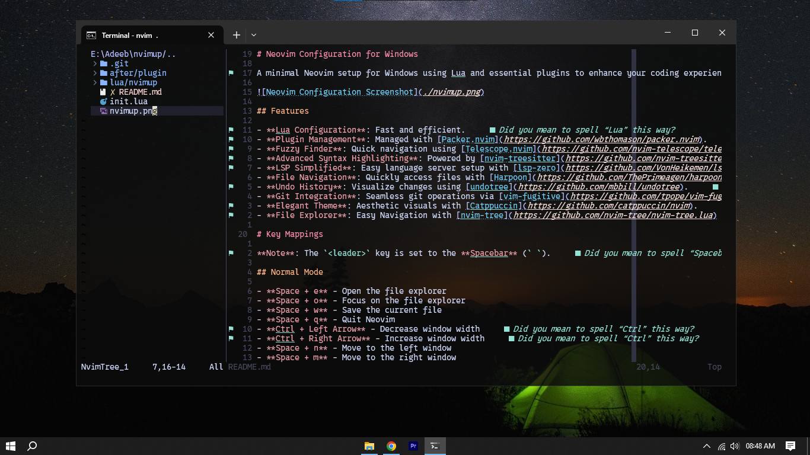

# Neovim Configuration for Windows

A minimal Neovim setup for Windows using Lua and essential plugins to enhance your coding experience.

## Features

- **Lua Configuration**: Fast and efficient.
- **Plugin Management**: Managed with [Packer.nvim](https://github.com/wbthomason/packer.nvim).
- **Fuzzy Finder**: Quick navigation using [Telescope.nvim](https://github.com/nvim-telescope/telescope.nvim).
- **Advanced Syntax Highlighting**: Powered by [nvim-treesitter](https://github.com/nvim-treesitter/nvim-treesitter).
- **LSP Simplified**: Easy language server setup with [lsp-zero](https://github.com/VonHeikemen/lsp-zero.nvim).
- **File Navigation**: Quickly access files with [Harpoon](https://github.com/ThePrimeagen/harpoon).
- **Undo History**: Visualize changes using [undotree](https://github.com/mbbill/undotree).
- **Git Integration**: Seamless git operations via [vim-fugitive](https://github.com/tpope/vim-fugitive).
- **Elegant Theme**: Aesthetic visuals with [Catppuccin](https://github.com/catppuccin/nvim).

# Key Mappings

**Note**: The `<leader>` key is set to the **Spacebar** (` `).

## Normal Mode

- **Space + e** - Open the file explorer
- **Space + o** - Open the file explorer in a horizontal split
- **Space + w** - Save the current file
- **Space + q** - Quit Neovim
- **Ctrl + Left Arrow** - Decrease window width
- **Ctrl + Right Arrow** - Increase window width
- **Space + n** - Move to the left window
- **Space + m** - Move to the right window
- **Press `J`** - Join the line below to the current line without moving the cursor
- **Ctrl + d** - Scroll down half a page and center the cursor
- **Ctrl + u** - Scroll up half a page and center the cursor
- **Press `n`** - Move to the next search match and center the screen
- **Press `N`** - Move to the previous search match and center the screen
- **Space + y** - Yank (copy) to the system clipboard
- **Space + Y** - Yank (copy) the entire line to the system clipboard
- **Space + d** - Delete without yanking (does not affect registers)
- **Press `Q`** - Disable Ex mode (unmaps `Q`)
- **Ctrl + f** - Open `tmux-sessionizer` in a new tmux window
- **Space + f** - Format the current buffer with LSP
- **Ctrl + k** - Next item in the quickfix list and center the cursor
- **Ctrl + j** - Previous item in the quickfix list and center the cursor
- **Space + k** - Next item in the location list and center the cursor
- **Space + j** - Previous item in the location list and center the cursor
- **Space + s** - Replace the word under the cursor throughout the file
- **Space + x** - Make the current file executable
- **Space + u** - Toggle the Undo Tree window

### Telescope Plugin Mappings

- **Space + p f** - Find files using Telescope
- **Ctrl + p** - Find Git-tracked files using Telescope
- **Space + p s** - Search for a string using Telescope's grep (prompts for input)

### Harpoon Plugin Mappings

- **Space + a** - Add the current file to Harpoon's marked files
- **Ctrl + e** - Toggle Harpoon's quick menu
- **Ctrl + h** - Navigate to Harpoon marked file 1
- **Ctrl + t** - Navigate to Harpoon marked file 2
- **Ctrl + n** - Navigate to Harpoon marked file 3
- **Ctrl + s** - Navigate to Harpoon marked file 4

### Custom Code Snippets

- **Space + e e** - Insert `if err != nil { return err }`
- **Space + e a** - Insert `assert.NoError(err, "")` and position the cursor inside the quotes
- **Space + e f** - Insert `if err != nil { log.Fatalf(...) }`
- **Space + e l** - Insert `if err != nil { .logger.Error(...) }`

## Insert Mode

- **jk** - Exit Insert mode
- **Ctrl + c** - Exit Insert mode

## Visual Mode

- **Press `J`** - Move selected text down
- **Press `K`** - Move selected text up
- **Space + p** - Paste over the selection without yanking

---

Enjoy a streamlined coding workflow on Windows!
